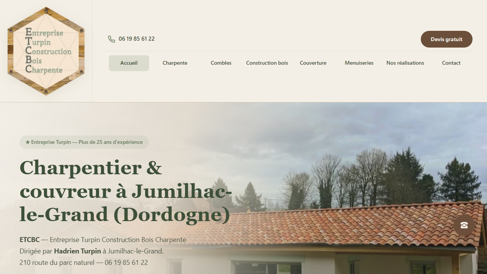

# ETCBC



Site professionnel pour **ETCBC** (Entreprise Turpin Construction Bois Charpente) — charpentier, couvreur et menuisier à Jumilhac-le-Grand (Dordogne).

| | |
|---|---|
| **URL production** | https://www.etcbc-charpente.com |
| **Dépôt GitHub** | [github.com/dariohd/ETCBC](https://github.com/dariohd/ETCBC) |
| **Notes techniques** | [docs/ARCHITECTURE.md](docs/ARCHITECTURE.md) |
| **Hébergement** | Vercel |
| **Création** | [Bulle ton site](https://bulletonsite.com) — Hugo Davion |

## Stack

- HTML5, CSS3, JavaScript vanilla (modules ES)
- Polices auto-hébergées (`/fonts/`)
- Galerie chantiers filtrable (`data/realisations.json` + JS)
- Formulaire contact → **FormSubmit** (`contact@etcbc-charpente.fr`)
- **sharp** (Node) pour les scripts d'optimisation images
- Vercel : clean URLs, CSP iframe, cache assets

## Fonctionnalités

- **6 métiers** : charpente, aménagement combles, construction bois, couverture, menuiseries, réalisations
- **Galerie filtrable** par type de chantier (`realisations.html`)
- **Zone d'intervention** : carte OpenStreetMap intégrée
- **FAQ** structurée (SEO local Dordogne)
- **Devis / contact** : formulaire avec notification email client
- SEO : JSON-LD (`js/seo.js`), canonicals, `sitemap.xml`, meta Open Graph
- **Mentions légales** (LCEN, RGPD, cookies)
- Responsive : 1100 / 1024 / 768 / 480 px

## Structure

```
ETCBC/
├── index.html
├── charpente.html, amenagement-combles.html, construction-bois.html
├── couverture.html, menuiseries.html, realisations.html
├── contact.html, mentions-legales.html
├── css/styles.css
├── js/main.js, seo.js
├── data/realisations.json
├── fonts/
├── images/gallery/
├── scripts/
├── vercel.json
├── sitemap.xml
└── robots.txt
```

## Prérequis

- Node.js 18+ (scripts images / polices)
- Compte Vercel + domaine `etcbc-charpente.com`

## Développement local

```bash
npm install          # sharp pour les scripts
npx serve . -l 3457
```

→ http://localhost:3457

Ne pas ouvrir `index.html` directement (modules ES + chemins absolus).

## Scripts de maintenance

```bash
node scripts/vendor-fonts.mjs       # Polices locales CNIL
node scripts/patch-clean-urls.mjs   # Liens sans .html + sitemap
node scripts/download-photos.mjs    # Import photos galerie
node scripts/process-logo.mjs       # Optimisation logo
```

## Services externes

| Service | Détail |
|---------|--------|
| **FormSubmit** | Emails vers `contact@etcbc-charpente.fr` uniquement |
| **OpenStreetMap** | Embed carte contact |
| **Vercel** | Production + redirects clean URLs |

Configuration site : constante `SITE` dans `js/main.js`.

## Déploiement

Push `main` → build Vercel automatique.

À vérifier après deploy :
- https://www.etcbc-charpente.com/charpente (sans `.html`)
- Redirections 301 depuis les anciennes URLs `.html`
- Formulaire contact → email Hadrien Turpin
- Galerie et filtres

## SEO

- `js/seo.js` : LocalBusiness, FAQ, WebSite, BreadcrumbList
- URL canonique : `https://www.etcbc-charpente.com`
- Sitemap : 8 pages indexables

## Conformité

- `/mentions-legales` : éditeur ETCBC, hébergeur Vercel, FormSubmit, CNIL
- Crédit : Bulle ton site
- Polices hébergées localement (pas de Google Fonts)

## Contact

- **Client** : Hadrien Turpin — ETCBC, Jumilhac-le-Grand
- **Email** : contact@etcbc-charpente.fr
- **Développement** : [bulletonsite.com](https://bulletonsite.com)
